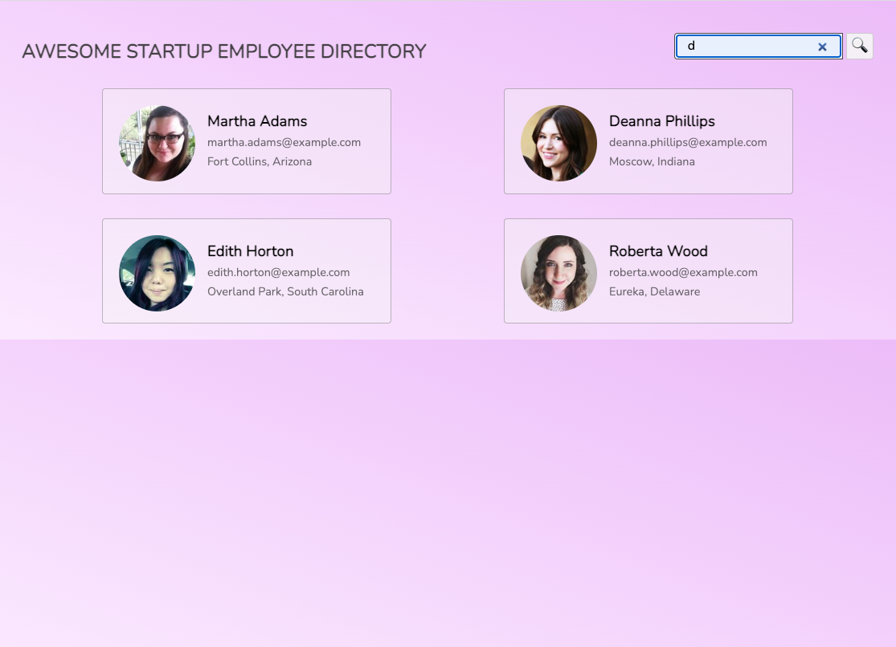
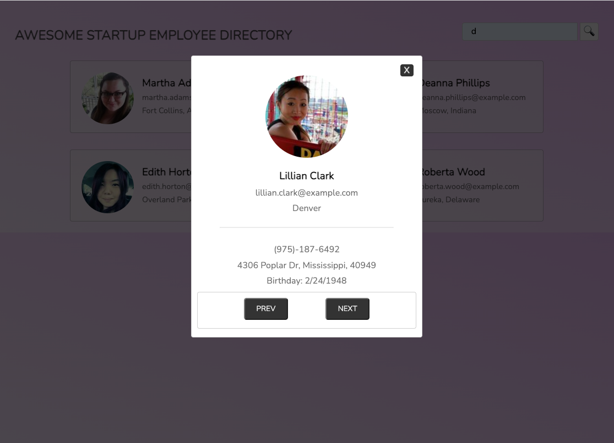

# Public API Requests
JavaScript | HTML | CSS | API

Dummy app of employee data requested from The Random User Generator API. The info generates 12 info cards and each card display a modal with more info about eaac employee.
Added a css color gradient background.

### Quick Start
1. Clone the repo-
2. Go to your project folder.
3. Open the index.Html tab and with a right click open it in a default browser.
